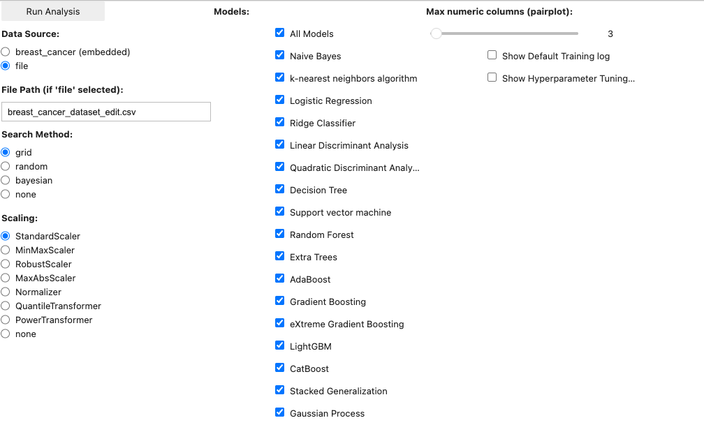
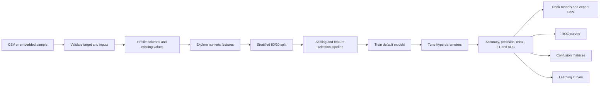
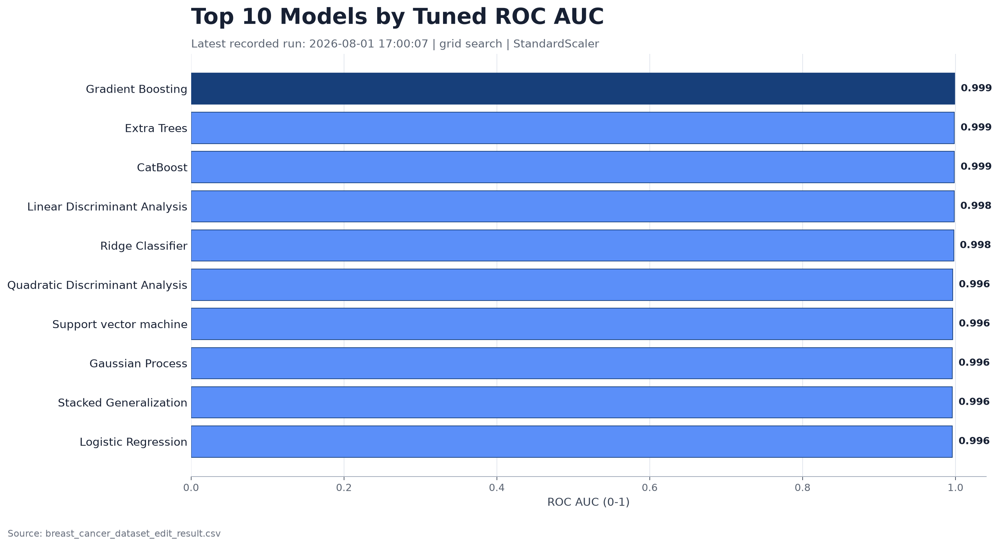

<p align="center">
  
</p>

<h1 align="center">PrimeSiftAI</h1>

<p align="center">
  An interactive machine-learning workbench for profiling tabular data, comparing binary classifiers, tuning hyperparameters, and reviewing model quality in one Jupyter notebook.
</p>

<p align="center">
  
  
  
  
</p>

<p align="center">
  <a href="https://colab.research.google.com/github/arslanmit/PrimeSiftAI/blob/main/AI_Core.ipynb">
    
  </a>
</p>

## What PrimeSiftAI Does

PrimeSiftAI turns a compatible CSV file into a complete model-comparison workflow. The notebook profiles the dataset, visualizes selected features, creates preprocessing pipelines, trains multiple classifiers, tunes their hyperparameters, and compares default and tuned performance.

The included example uses the [Breast Cancer Wisconsin (Diagnostic) dataset](https://archive.ics.uci.edu/dataset/17/breast-cancer-wisconsin-diagnostic) from the UCI Machine Learning Repository.

| Included example | Value |
| --- | ---: |
| Observations | 569 |
| Numeric features | 30 |
| Target classes | 2 |
| Class `0` samples | 357 |
| Class `1` samples | 212 |
| Train/test split | 80% / 20% |
| Compared classifiers | 17 |

## Interface Preview



The interface keeps the main decisions in one place:

1. Choose the embedded sample or provide a CSV file.
2. Select a search method, scaling strategy, and model subset.
3. Click **Run Analysis** to profile, train, tune, compare, visualize, and export.

For a quick first run, select one or two models and set **Search Method** to `none`. Running all 17 models with grid, random, or Bayesian search can take considerably longer.

## Analysis Workflow



## Latest Recorded Model Comparison



The chart is generated from `breast_cancer_dataset_edit_result.csv`. In the latest recorded run, the notebook used grid search and `StandardScaler` across all 17 models. Gradient Boosting produced the highest tuned ROC AUC in that run at approximately `0.999`.

These values describe one recorded train/test experiment. They are not a clinical benchmark and should not be interpreted as evidence of real-world diagnostic performance.

Rebuild the chart after a new analysis run:

```bash
source .venv/bin/activate
python scripts/generate_readme_chart.py
```

## Model Coverage

| Family | Models |
| --- | --- |
| Linear and probabilistic | Logistic Regression, Ridge Classifier, Naive Bayes |
| Discriminant analysis | Linear Discriminant Analysis, Quadratic Discriminant Analysis |
| Neighbourhood and kernel | K-Nearest Neighbours, Support Vector Machine, Gaussian Process |
| Tree-based | Decision Tree, Random Forest, Extra Trees |
| Boosting | AdaBoost, Gradient Boosting, XGBoost, LightGBM, CatBoost |
| Ensemble | Stacked Generalization |

## Search and Scaling Options

| Hyperparameter search | Feature scaling |
| --- | --- |
| Grid search | StandardScaler |
| Randomized search | MinMaxScaler |
| Bayesian search | RobustScaler |
| No search | MaxAbsScaler |
|  | Normalizer |
|  | QuantileTransformer |
|  | PowerTransformer |
|  | No scaling |

## Evaluation Metrics

| Metric | What it answers |
| --- | --- |
| Accuracy | What proportion of all predictions was correct? |
| Precision | How often was a predicted positive actually positive? |
| Recall | How many actual positives did the model identify? |
| F1 score | How well does the model balance precision and recall? |
| ROC AUC | How well does the model separate the two classes across thresholds? |

PrimeSiftAI displays default and tuned values side by side so that tuning gains and regressions remain visible.

## Quick Start

### Option 1: Run locally with `uv`

```bash
git clone https://github.com/arslanmit/PrimeSiftAI.git
cd PrimeSiftAI

uv venv --python 3.12 .venv
source .venv/bin/activate

uv pip install jupyterlab numpy pandas matplotlib seaborn ipywidgets \
  scikit-learn xgboost lightgbm scikit-optimize tqdm catboost "dask[dataframe]"

jupyter lab AI_Core.ipynb
```

### Option 2: Run in Google Colab

Use the **Open in Colab** badge at the top of this README. Run the notebook cell, choose the analysis settings, and click **Run Analysis**.

## Input Data Contract

Custom input must be a CSV file containing a binary target column named exactly `target`:

```csv
target,feature_1,feature_2,feature_3
0,1.25,7.10,12
1,2.80,5.45,19
```

The workflow expects:

- A numeric binary `target` column.
- Enough observations from both classes for stratified splitting and cross-validation.
- Feature columns compatible with the selected preprocessing and models.
- Missing values to be reviewed before training.

The original example file contains `diagnosis`, while the prepared notebook input uses `target`. PrimeSiftAI does not automatically convert `diagnosis`; use `breast_cancer_dataset_edit.csv` or prepare a compatible file first.

## Generated Output

For an input named `my_dataset.csv`, PrimeSiftAI appends each completed comparison to:

```text
my_dataset_result.csv
```

Each row records:

- Default and tuned accuracy, precision, recall, F1, and AUC
- Selected search and scaling methods
- Execution timestamp
- Model name

The notebook also renders data profiling, a configurable pair plot, ROC curves, confusion matrices, and learning curves.

## Project Structure

```text
PrimeSiftAI/
├── AI_Core.ipynb
├── breast_cancer_dataset.csv
├── breast_cancer_dataset_edit.csv
├── breast_cancer_dataset_edit_result.csv
├── PrimeSiftAI Logo.webp
├── scripts/
│   └── generate_readme_chart.py
└── output/
    └── playwright/
        ├── primesiftai-interface.png
        └── latest-run-tuned-auc.png
```

| Path | Purpose |
| --- | --- |
| `AI_Core.ipynb` | Interactive analysis application |
| `breast_cancer_dataset.csv` | Original example dataset with `diagnosis` |
| `breast_cancer_dataset_edit.csv` | Prepared example dataset with `target` |
| `breast_cancer_dataset_edit_result.csv` | Recorded model-comparison history |
| `scripts/generate_readme_chart.py` | Rebuilds the README model-ranking chart |

## Responsible Use

PrimeSiftAI is an educational and exploratory model-comparison tool. It is not a medical device, clinical decision-support system, or production inference service.

Before any real-world use, independently review:

- Data leakage and duplicate observations
- Class imbalance and threshold selection
- Performance across demographic and clinical subgroups
- Calibration and external validation
- Model interpretability and human oversight
- Privacy, security, and applicable medical regulations

High accuracy or AUC on a small benchmark dataset does not guarantee safe performance on new patients or data from another institution.

## Dataset Credit

Wolberg, W., Mangasarian, O., Street, N., and Street, W. (1993). *Breast Cancer Wisconsin (Diagnostic)*. UCI Machine Learning Repository. [https://doi.org/10.24432/C5DW2B](https://doi.org/10.24432/C5DW2B).

## License

No project license file is currently included. Add a license before distributing or reusing the project beyond the permissions provided by GitHub and the licenses of its dependencies and dataset.
